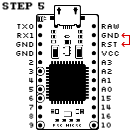
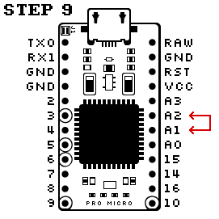

# Contra Flashing

I can honestly add nothing more to [the instructions](https://cartel.ltd/projects/contra/#flash) provided by Cartel, they are as complete as they can be.  
Just for offline usage, I like to copy these docs so they remain accessible.

## Provided instructions

Flashing the Pro Micro
  

  - Open QMK Toolbox.
  - Select your .hex filer under “Local file” and set the Micro-controller to “atmega32u4”.
  - Select the “Auto-Flash” check box.
  - Plug your Pro Micro in to your computer, a green LED should light up on the ProMicro.
  - Use a wire to short “RST” and “GND” together on your ProMicro.
  - Remove the wire. QMK Toolbox should detect a “Caterina device” and begin the flash process. Two red LEDs should flash a number of times.
  - The red LEDs should turn off. QMK Toolbox should list “Caterina device disconnected”.
  - Unplug the ProMicro. Plug it back in. Your computer should detect it as a keyboard.
  - Short “A1” to “A2” with notepad or a similar application open. Characters should be typed.
  - If characters appear after shorting “A1” to “A2”, your Pro Micro has been flashed successfully. Let’s build!

Reprogramming the Pro Micro
  

  - Open QMK Toolbox.
  - Select your .hex filer under “Local file” and set the Micro-controller to “atmega32u4”.
  - Select the “Auto-Flash” check box.
  - Plug your USB cable in while holding down the reset switch.
  - Release the reset switch. QMK Toolbox should detect a “Caterina device” and begin the flash process. Two red LEDs should flash a number of times.
  - Remove the wire. QMK Toolbox should detect a “Caterina device” and begin the flash process. Two red LEDs should flash a number of times.
  - The red LEDs should turn off. QMK Toolbox should list “Caterina device disconnected”.
  - Unplug the ProMicro. Plug it back in. Your computer should detect it as a keyboard.
  - Your keyboard should be reprogrammed with your new layout, enjoy!
