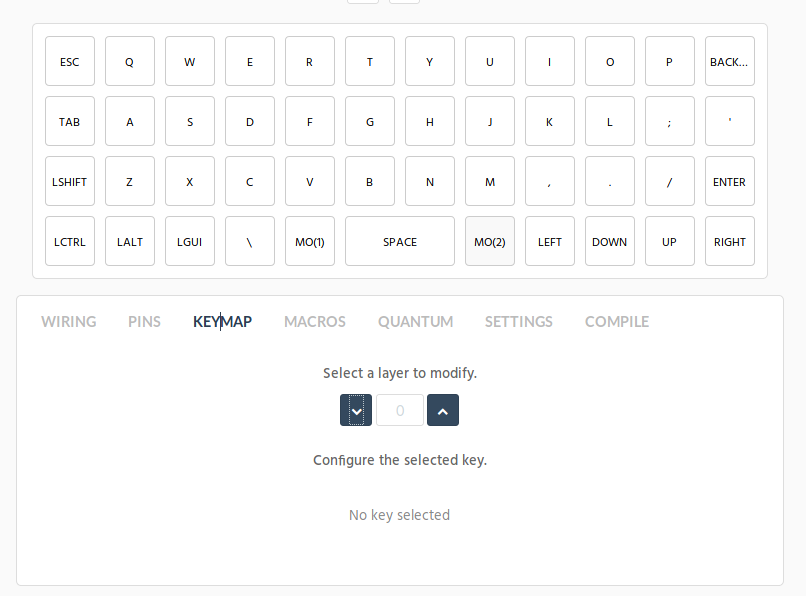
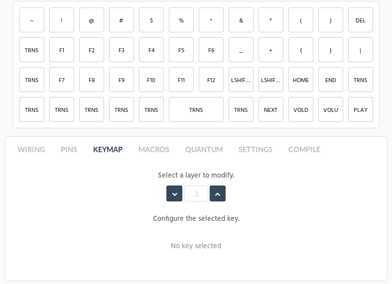
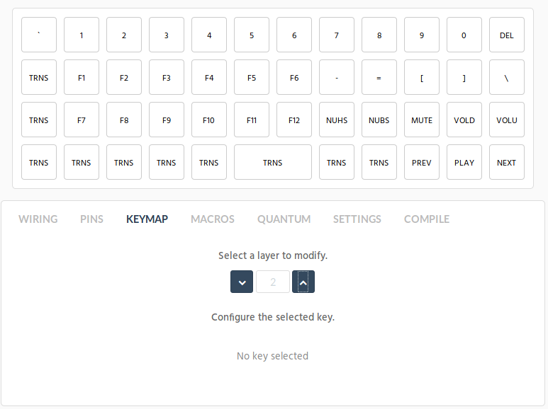

# Danck LAYOUT

This is the 2nd custom layout I'm trying out for this board, where the basis comes from the planck.
I liked their layout a bit more than the default Contra one, so going with that atm.

## Screenshots

